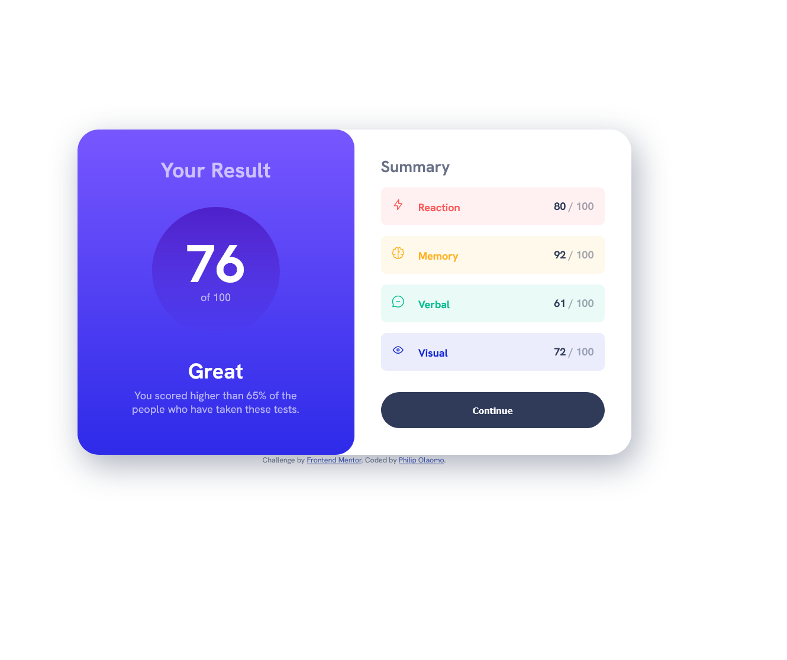
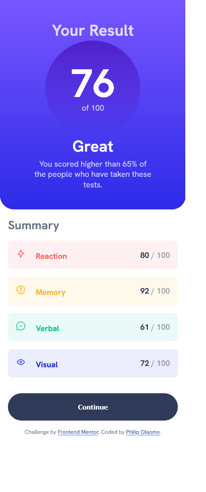

# Frontend Mentor - Results summary component solution

This is a solution to the [Results summary component challenge on Frontend Mentor](https://www.frontendmentor.io/challenges/results-summary-component-CE_K6s0maV). Frontend Mentor challenges help you improve your coding skills by building realistic projects. 

## Table of contents

- [Overview](#overview)
  - [The challenge](#the-challenge)
  - [Screenshot](#screenshot)
  - [Links](#links)
- 
  - [Built with](#built-with)
  - [What I learned](#what-i-learned)
  - [Continued development](#continued-development)
  - [Useful resources](#useful-resources)
- [Author](#author)
- [Acknowledgments](#acknowledgments)


## Overview

### The challenge

Users should be able to:

- View the optimal layout for the interface depending on their device's screen size
- See hover and focus states for all interactive elements on the page

### Screenshot





### Links

- Solution URL: [Add solution URL here](https://your-solution-url.com)
- Live Site URL: [Add live site URL here](https://your-live-site-url.com)

## My process

### Built with

- Semantic HTML5 markup
- CSS custom properties
- Flexbox
- CSS Grid
- CSS custom Root
- Media Querry


### What I learned


To see how you can add code snippets, see below:


```css
.result-display {
    text-align: center;
    display: grid;

    color: hsla(0, 0%, 100%, 0.8);
    border-radius: 0 0 1.75rem 1.75rem;
    padding: var(--padding);
    background-image: linear-gradient(hsl(252, 100%, 67%), hsl(241, 81%, 54%));
}
:root {

    --clr-neutral-white: hsl(0, 0%, 100%);
    --clr-neutral-blue: hsl(221, 100%, 96%);
    --clr-neutral-lav: hsl(241, 100%, 89%);
    --clr-neutral-drk-grey-blue: hsl(224, 30%, 27%);

    --clr-primary-light-red: hsl(0, 100%, 67%);
    --clr-primary-orangey-yellow: hsl(39, 100%, 56%);
    --clr-green-teal: hsl(166, 100%, 37%);
    --clr-primary-cobalt-blue: hsl(234, 85%, 45%);

    --fs-1: 1.125rem;
    --fs-2: 1.25rem;
    --fs-3: 1.5rem;
    --fs-4: 1.75rem;
    --fs-5: 2rem;
    --fs-6: 5rem;
    --ff-general: 'HankenGrotesk';

    --clr-category-1: rgba(255, 87, 87, 0.081);
    --clr-category-2: hsla(39, 100%, 56%,  0.081);
    --clr-category-3: hsla(166, 100%, 37%,  0.081);
    --clr-category-4: hsla(234, 85%, 45%,  0.081);
}
```


### Continued development

-Css Custom root
-working with grids and flext better


### Useful resources

- [W3 schools](https://www.w3schools.com/css/css3_shadows_box.asp, https://www.w3schools.com/html/html_colors_hsl.asp, https://www.w3schools.com/html/html_colors_hsl.asp) - This helped me for to master creating a gradient, box-shadow and hssla.
- [kevin Powel](https://youtu.be/KqFAs5d3Yl8) - This is an amazing video that gives strategies and professional view on this projeect I'd recommend it to anyone still learning this concept.


## Author


- Website - [Olaomo Philip]
- Frontend Mentor - [@lastiroko](https://www.frontendmentor.io/profile/lastiroko)


## Acknowledgments

Kudos to myself, W3 schools and Kevin Powell.